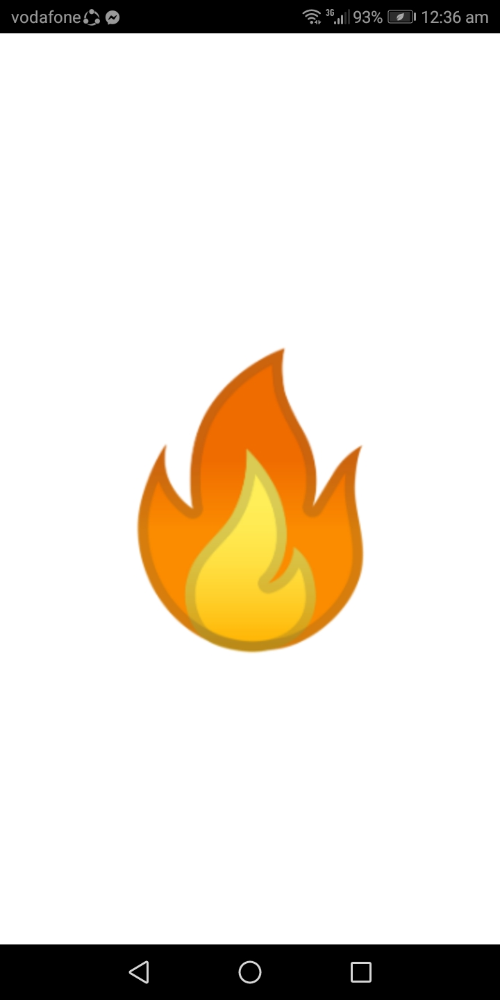
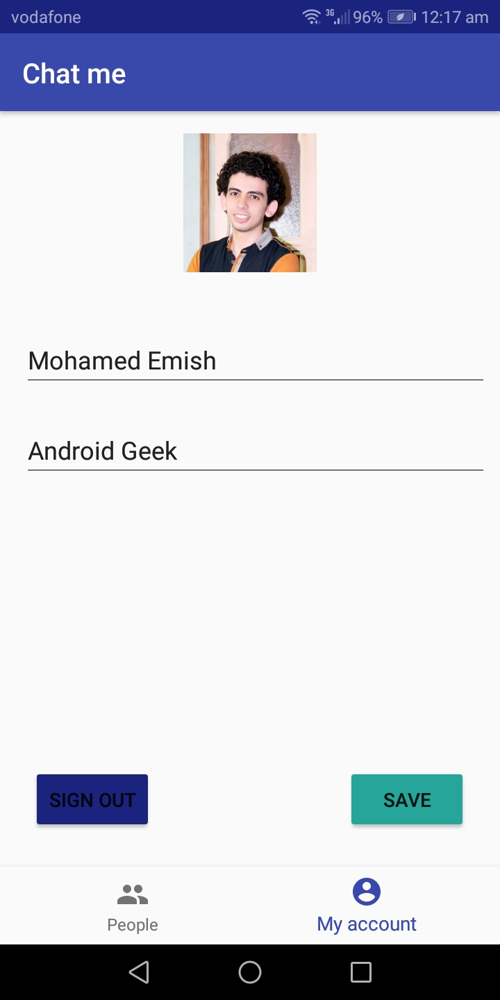
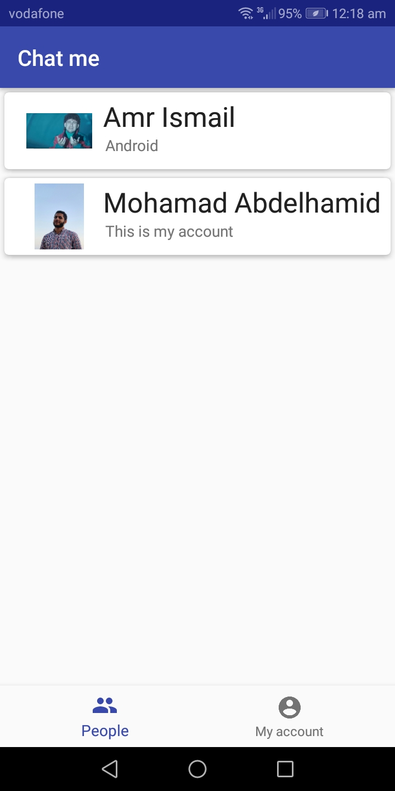
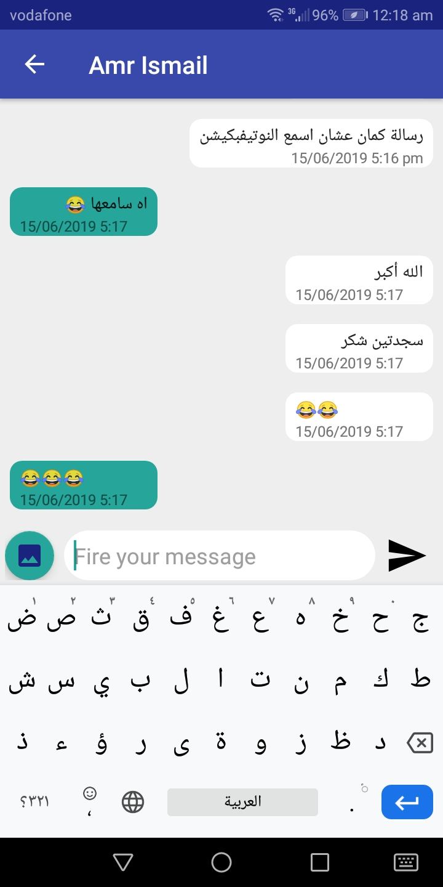

# Chat me
</a>

- This app is a self improvment app
- It's a simple chat app uses firebase database for users and messages.
- Also sending notification on message recieve throw firebase cloud messaging
- This app is written in kotlin.

# Liberaries used

- [Kotlin programing language](#kotlin-stdlib-jdk7:1.3.31)
- [Anko](#anko:0.10.8 design and coroutines)
- [Firebase: firestore,storage,messaging and auth] 
- [Glide](#glide:4.9.0)
- [Groupie: a recycler view builder](#groupie:2.0.3)

# Screenshots

## Reach out to me at one of the following places!

- Mail me at <a href="emish52020@gmail" target="_blank">`Emish52020@gmail`</a>
